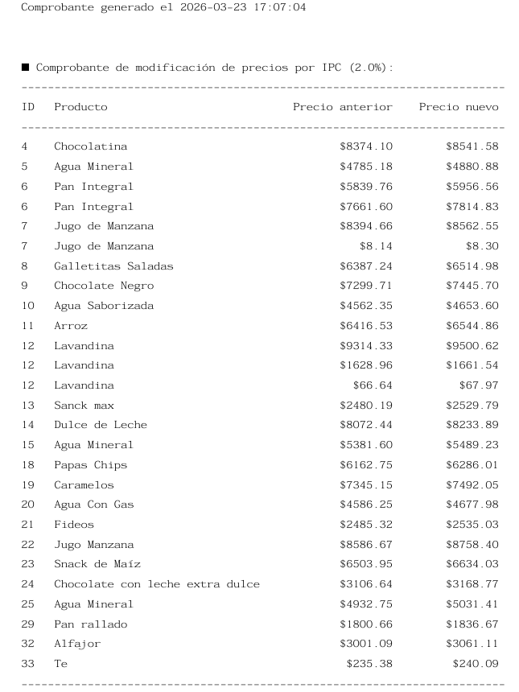
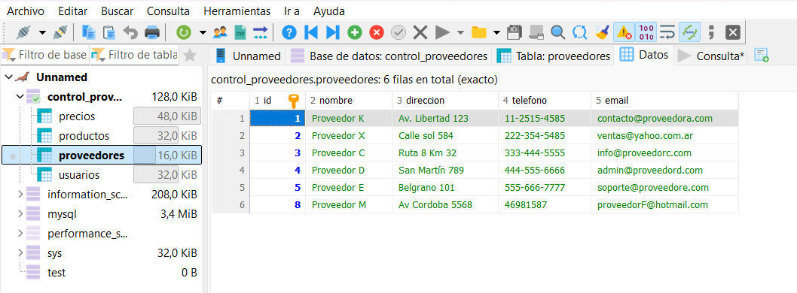
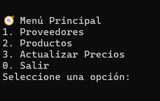
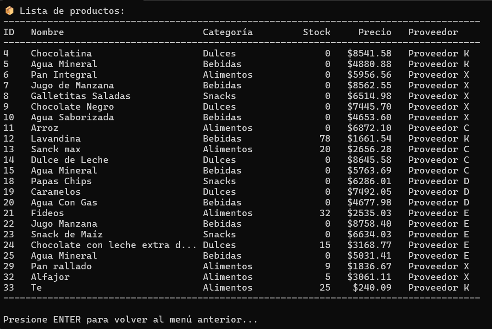

# 📦 Sistema de Gestión de Proveedores y Control de Stock

Este es un sistema integral desarrollado en **Python** y **MariaDB** diseñado para automatizar 
la administración de suministros, precios y proveedores. El proyecto nació de la necesidad de
centralizar la información operativa y facilitar la toma de decisiones basada en datos reales de stock.

### ✨ Funcionalidades
* **Gestión de Proveedores:** Alta, baja y modificación de datos de contacto.
* **Control de Stock Dinámico:** Seguimiento en tiempo real de productos y existencias.
* **Generación de Reportes:** Creación automática de comprobantes en formato **PDF** para registros administrativos.

* **Arquitectura Modular:** Código organizado en módulos específicos para facilitar la escalabilidad.

### 🛠️ Tecnologías y Herramientas
* **Lenguaje:** Python 3.12
* **Librerías principales:** 
	* `mariadb`: Conector oficial para integración de BD.
    * `reportlab`: Generación y diseño de documentos PDF.
* **Base de Datos:** MariaDB (Gestionada con HeidiSQL)
* **Diseño de Base de Datos:**

Se implementó un esquema relacional con integridad referencial, utilizando AUTO_INCREMENT para claves 
primarias y restricciones NOT NULL en campos críticos para asegurar la calidad del dato.   
    
### 🚀 Instalación

1. Clonar el repositorio:
   `git clone https:github.com/enzoSS01/gestion-proveedores-python`

2. Instalar dependencias:
   `pip install mariadb reportlab`

3. Configuración de Base de Datos:
   * Importar el archivo database_setup.sql en HeidiSQL para crear automáticamente las tablas y cargar los datos iniciales.
   * Configurar las credenciales en el archivo correspondiente (se recomienda el uso de variables de entorno).
   
### 🖼️ Vista Previa del Sistema

**Menú Principal e Interfaz:**

**Gestión de Datos y Reportes:**

*(Captura del sistema interactuando con la base de datos MariaDB)*
